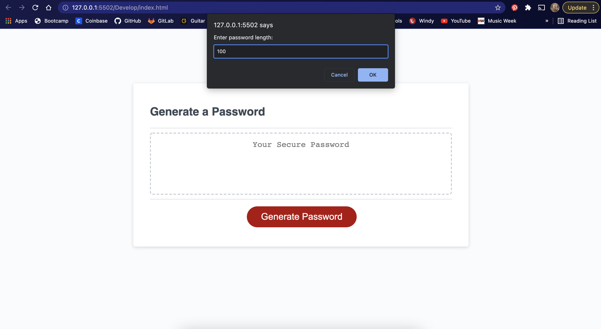
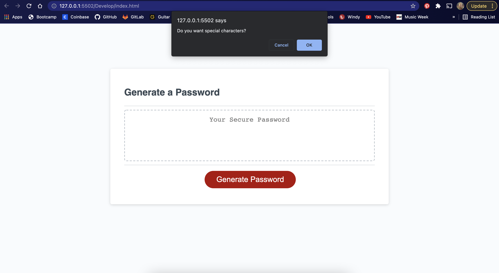
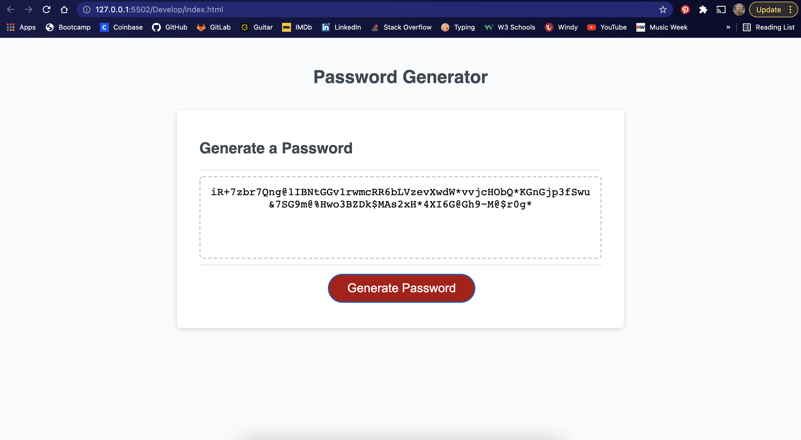

# 🏗️ Password Generator

Link : https://caswellorr.github.io/Password-Generator/

## Description 📖

The Password Generator, you guessed it, generates a password tailored to the user's preferences. The user may choose the length, between 8 and 100, and the type of characters they want in their password.

## Features 📝

This application uses JavaScript to generate the password.

Arrays, Functions, Conditional Statements, a For Loop, and While Loops are implented to do so.

## Screenshots 📷 :

* User is prompted to choose the number of characters they want in their password:

  
  
* User decides what type of characters they want in their password:

  

* User is presented with a tailored password:

  
  

## Takeaways 💡

I learned how to concatinate large arrays into an even larger one then use that array, based on user's decisions, to generate another array of randomized characters. 

----
© 2021 Caswell Orr. Confidential and Proprietary. All Rights Reserved.
